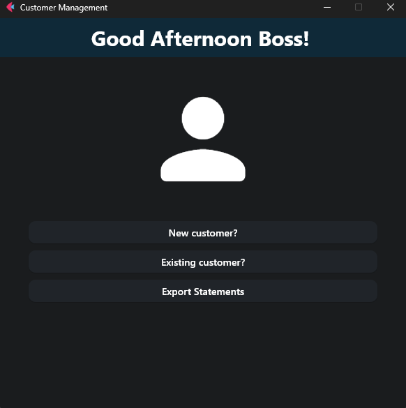
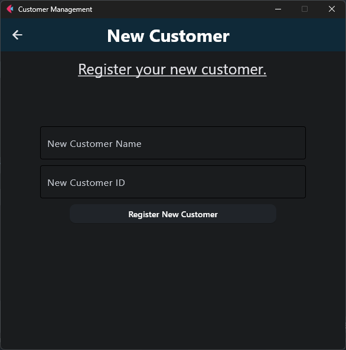
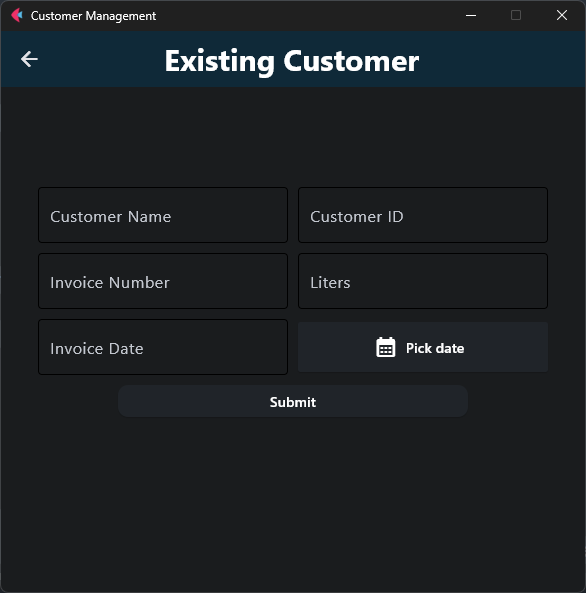
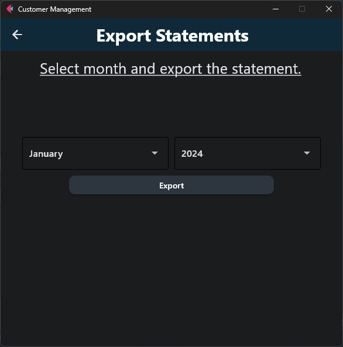

# Customer Management System

## Overview
This is a simple Customer Management System built using Python and the flet library for creating graphical user interfaces. It allows users to register new customers, manage existing customer data, and export statements.

## Features
- **New Customer Registration**: Easily register new customers by providing their name and ID.
- **Existing Customer Management**: Add invoices for existing customers, including details like liters purchased and invoice date.
- **Export Statements**: Generate statements for a selected month and year, exporting data to an Excel file.

## Dependencies
- Python 3.x
- flet library
- pandas
- mysql.connector
- openpyxl

## Setup
1. Clone the repository:
    ```bash
    git clone https://github.com/kyprosantreou/customer-management.git
    ```
2. Install dependencies:
    ```bash
    pip install -r requirements.txt
    ```
3. Configure MySQL database connection details in the main function of `main.py`.

## Usage
1. Run the application:
    ```bash
    flet run main.py
    ```
2. Use the graphical interface to perform various tasks such as registering new customers, managing existing customer data, and exporting statements.

## Screenshots
 
 
Created by Kypros Andreou
